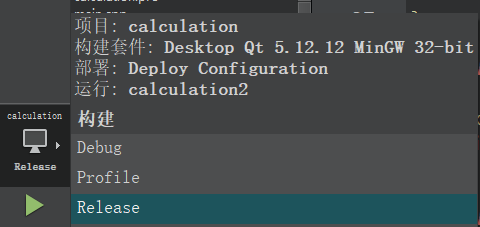

# Qt_Projects

## Files Description

### runable_exe: what as its name

### calculator :qt project

## Overview


## Project Struct

- **calculation.pro**: This is a project file used by Qt Creator to manage the build settings for the project.控制全局设置，包含引入模块
- **calculation.pro.user**: This file contains user-specific settings for the project, such as compiler paths or additional include directories.
- **favice.ico**: This is an icon file, likely used for the application's window icon.
- **main.cpp**: This is the main source file where the execution of the program begins. It typically contains the `main()` function.
- **res.qrc**: This is a resource file that can be used to embed resources like images, icons, or other data into the executable.
- **widget.cpp**: This is a C++ source file that likely contains the implementation of a widget class.具体实现，面对对象
- **widget.h**: This is a header file that declares the widget class.声明成员变量，引入包
- **widget.ui**: This is a user interface file created using Qt Designer. It defines the layout and components of the widget.

### widget.h

```
#ifndef WIDGET_H
#define WIDGET_H

#include <QWidget>
#include <QJSEngine> // 引入包
#include <QMessageBox> // 添加此行

QT_BEGIN_NAMESPACE
namespace Ui { class Widget; }
QT_END_NAMESPACE

class Widget : public QWidget
{
    Q_OBJECT

public:
    Widget(QWidget *parent = nullptr);
    ~Widget();

private slots:
    void on_OneButton_released();
    void on_TwoButton_released();
    void on_ThreeButton_released();
    void on_FourButton_released();
    void on_FiveButton_released();
    void on_SixButton_released();
    void on_Seven_Button_released();
    void on_EightButton_released();
    void on_NineButton_released();
    void on_ZeroButton_released();
    void on_AddButton_released();
    void on_SubButton_released();
    void on_WorkButton_released();
    void on_CleraButton_released();
    void on_DeleteButton_released();

private:
    Ui::Widget *ui;
    QString expression;//声明成员变量
};
#endif // WIDGET_H

```


### widget.cpp

```
#include "widget.h"
#include "ui_widget.h"


Widget::Widget(QWidget *parent)
    : QWidget(parent)
    , ui(new Ui::Widget)
{
    ui->setupUi(this);
    this->setMaximumSize(340,370);//对对象的操作，对界面的操作
    this->setMinimumSize(340,370);
    this->setWindowTitle("calculator");
    this->setWindowIcon(QIcon("://favice.ico"));
    // 设置WorkButton的背景颜色
    ui->WorkButton->setStyleSheet("background-color: yellow;");
}

Widget::~Widget()
{
    delete ui;
}
//槽函数
void Widget::on_OneButton_released()
{
    expression += "1";
    ui->lineEdit->setText(expression);
}

void Widget::on_TwoButton_released()
{
    expression += "2";
    ui->lineEdit->setText(expression);
}

void Widget::on_ThreeButton_released()
{
    expression += "3";
    ui->lineEdit->setText(expression);
}

void Widget::on_FourButton_released()
{
    expression += "4";
    ui->lineEdit->setText(expression);
}

void Widget::on_FiveButton_released()
{
    expression += "5";
    ui->lineEdit->setText(expression);
}

void Widget::on_SixButton_released()
{
    expression += "6";
    ui->lineEdit->setText(expression);
}

void Widget::on_Seven_Button_released()
{
    expression += "7";
    ui->lineEdit->setText(expression);
}

void Widget::on_EightButton_released()
{
    expression += "8";
    ui->lineEdit->setText(expression);
}

void Widget::on_NineButton_released()
{
    expression += "9";
    ui->lineEdit->setText(expression);
}

void Widget::on_ZeroButton_released()
{
    expression += "0";
    ui->lineEdit->setText(expression);
}

void Widget::on_AddButton_released()
{
    expression += "+";
    ui->lineEdit->setText(expression);
}

void Widget::on_SubButton_released()
{
    expression += "-";
    ui->lineEdit->setText(expression);
}

void Widget::on_WorkButton_released()
{
    // 计算表达式的结果
    QJSEngine engine;
    QJSValue result = engine.evaluate(expression);

    if (result.isError()) {
        // 如果表达式有错误，弹出警告对话框并清空lineEdit内容
        QMessageBox::warning(this, "错误", "输入的表达式不合理，请重新输入！");
        expression = "";
        ui->lineEdit->setText("");
    } else {
        QString resultString = result.toString();
        // 将结果显示在lineEdit中
        ui->lineEdit->setText(resultString);
    }
}

void Widget::on_CleraButton_released()
{
    expression = "";
    ui->lineEdit->setText("");
}

void Widget::on_DeleteButton_released()
{
    if (!expression.isEmpty()) {
        expression.chop(1); // 删除最后一个字符
        ui->lineEdit->setText(expression);
    }
}


```

## Operate Note

## 资源管理

图片资源都是这么管理的，可以使用相对路径

### Add Icon

#### 1.创建一个资源管理


##### 1.1


##### 1.2


##### 1.3添加图片


#### 2 widget.cpp实现

```
this->setWindowIcon(QIcon("://favice.ico"));
```

### 补充

#### 添加背景图的实现

使用  “：/” 表示从资源管理中获取

```
 QPixmap pix1 = QPixmap(":/image/swim.png").scaled(this->size());

   //    //将图片设置为背景
       QPalette palette;
      palette.setBrush(QPalette::Background,QBrush(pix1));
      this->setPalette(palette);
```


### Package

#### 环境需要：Enigma Virtual Box和QT 命令行

##### 1.在release下生成



##### 2.新建一个文件夹，将yourprojectpath/build_xxx/debug/yourproject.exe移动到此文件夹，package

##### 3.打开qt命令行，跳转到该目录，执行

```
windeployqt yourproject.exe
```

然后它就会找来所有依赖的文件

##### 4.使用Enigma Virtual Box，将yourproject.exe与众多依赖文件合并成一个exe文件


此处加入依赖文所在的目录

![](README.assets/image-2025-03-08 115106.png


然后proccess。
