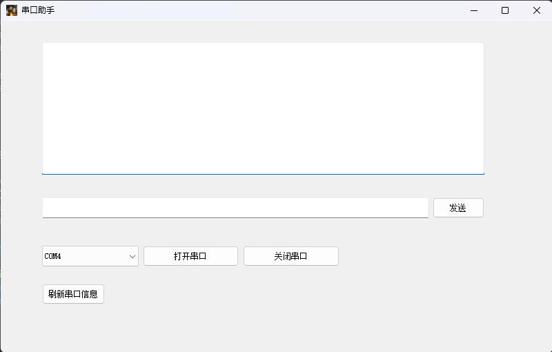

# README

## PACKAGE USED

### QSerialPortInfo

用于获取串口信息

### QSerialPort

1.串口配置

2.接收与发送串口数据

#### QSerialPortInfo

将获取到的数据存在列表里，随后存入组合框中

```
 serilaPort = new QSerialPort(this);
    QStringList serialNamePort;
    foreach (const QSerialPortInfo &info ,QSerialPortInfo::availablePorts()) {
        serialNamePort<<info.portName();
    }
    ui->comboBox->addItems(serialNamePort);
```


#### QSerialPort

初始化串口配置，占用串口

```
 QString str = ui->comboBox->currentText();

    QSerialPort::BaudRate baudRate;
    QSerialPort::DataBits dataBits;
    QSerialPort::StopBits stopBits;
    QSerialPort::Parity checkBits;
    //使用默认配置进行串口初始化
    baudRate = QSerialPort::Baud115200;
    dataBits = QSerialPort::Data8;
    stopBits = QSerialPort::OneStop;
    checkBits = QSerialPort::NoParity;
    //整合串口配置
    serilaPort->setPortName(ui->comboBox->currentText());
    serilaPort->setBaudRate(baudRate);
    serilaPort->setDataBits(dataBits);
    serilaPort->setStopBits(stopBits);
    serilaPort->setParity(checkBits);

    //以读写打开串口
    if(serilaPort->open(QIODevice::ReadWrite) == true){
        ui->textBrowser->setTextColor(Qt::green);
        ui->textBrowser->append("成功打开串口：" + str + "= = = = = = = = = = = = = = = = =\r\n");
    }else{
        ui->textBrowser->setTextColor(Qt::red);
        ui->textBrowser->append("失败打开串口：" + str + "= = = = = = = = = = = = = = = = =\r\n");
    }
```


连接接收串口信号

```
 connect(serilaPort,SIGNAL(readyRead()),this,SLOT(serilaPortReadyRead_Slot()));//串口接收信号
```


处理接收数据

```
void Widget::serilaPortReadyRead_Slot(){
    QString buf;
    buf = QString(serilaPort->readAll());
    ui->textBrowser->setTextColor(Qt::black);
    ui->textBrowser->append("接收内容：" + buf);
}
```

### OVERVIEW


