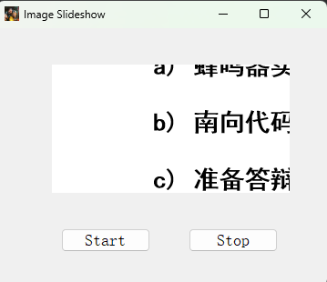

# README

## OVERVIEW



## USED CLASS

### QOJECT

是很多类的父类，有定时器相关方法实现

#### 使用方法

QOJECT有一个timerEvent(Event* ）需要重写，它会在定时器结束时被调用。重写到时间后的逻辑

### QPIXMAP

图片的类

## widget.h

```
#ifndef WIDGET_H
#define WIDGET_H

#define TIMEOUT 1000
#include <QWidget>
QT_BEGIN_NAMESPACE
namespace Ui { class Widget; }
QT_END_NAMESPACE

class Widget : public QWidget
{
    Q_OBJECT

public:
    Widget(QWidget *parent = nullptr);
    void timerEvent(QTimerEvent *event);
    ~Widget();

private slots:
    void on_StartButton_clicked();

    void on_StopButton_released();

private:
    Ui::Widget *ui;
    int timer_id;
    int pic_cnt = 1;
};
#endif // WIDGET_H

```

## widget.cpp

```
#include "widget.h"
#include "ui_widget.h"
Widget::Widget(QWidget *parent)
    : QWidget(parent), ui(new Ui::Widget)
{
    ui->setupUi(this);
    QPixmap pic("://1.png");
    ui->Picture->setPixmap(pic);
    //设置标题
    this->setWindowTitle("Image Slideshow");
    this->setWindowIcon(QIcon("://favice.ico"));
}

Widget::~Widget()
{
    delete ui;
}

void Widget::on_StartButton_clicked()
{
    timer_id = this->startTimer(TIMEOUT);
}
void Widget::timerEvent(QTimerEvent *event)
{
    if (event->timerId() != timer_id)
        return;
    // 更新图片
    pic_cnt++;
    if (pic_cnt > 3)
        pic_cnt = 1;
    QString str = QString("://%1.png").arg(pic_cnt);
    QPixmap pic(str);
    ui->Picture->setPixmap(pic);
}

void Widget::on_StopButton_released()
{
    this->killTimer(timer_id);
}


```

